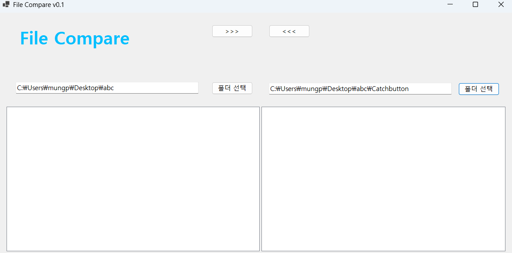
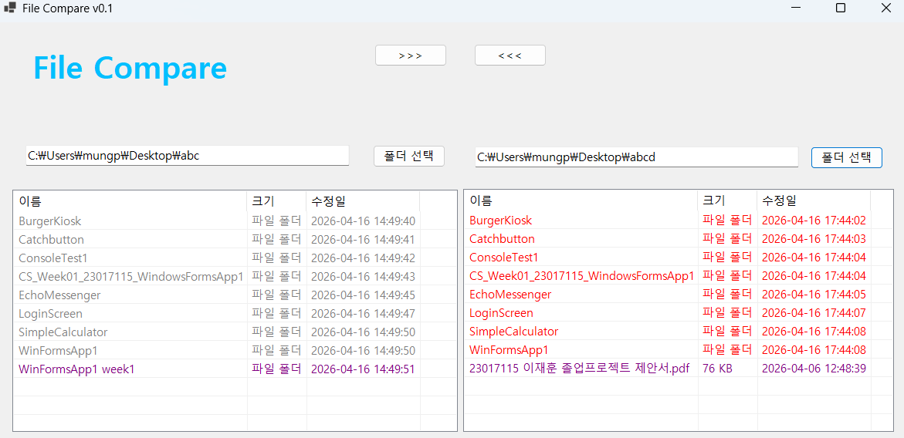
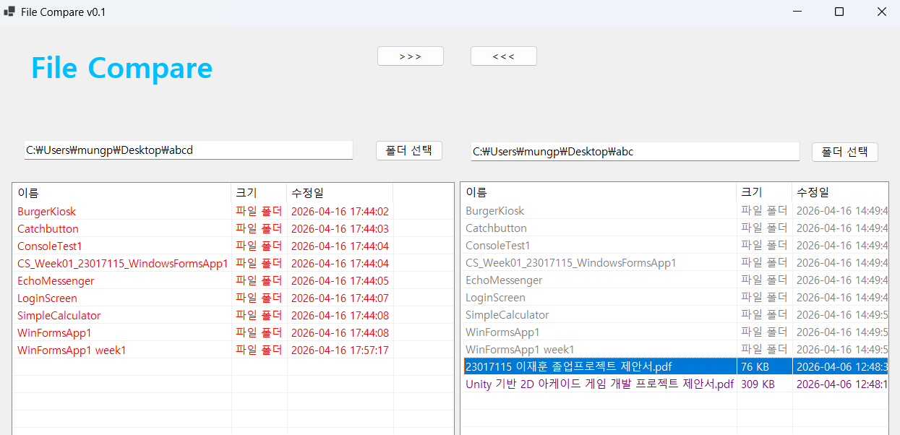
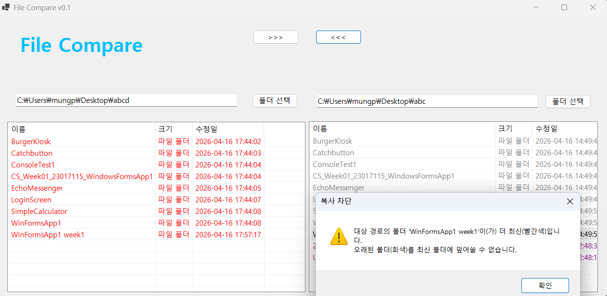

# (C# 코딩) FileCompare
## 개요
- C# 프로그래밍 학습
- 핵심기능: ...
- 화면구성: ...
## 실행 화면 (과제1)
- 1단계 코드의 실행 스크린샷
 
  

## 실행 화면 (과제2)
- 2단계 코드의 실행 스크린샷
  
  
  
  

# (C# 코딩) FileCompare
## 개요
  - File Compare 프로그램을 기반으로 C# 프로그래밍 학습
 

## 실행 화면 (과제1)
  - 코드의 실행 스크린샷과 구현 내용 설명
	 
  

- 구현한 내용 (위 그림 참조)
- 기본적인 UI 배치(UI는 Beyond Compare5를 참조하여 구성)
## 실행 화면 (과제2)
- 코드의 실행 스크린샷과 구현 내용 설명

  
  
  

  - 구현한 내용 (위 그림 참조)
	- 파일 비교 기능 구현 : 두 개의 파일을 선택하여 비교하는 기능 구현
	- 파일 비교가 쉬워지게 색상 구분

# (C# 코딩) File Compare
## 개요
- C# 프로그래밍 학습
- 1줄 소개: File Compare 프로그램을 기반으로 C# 프로그래밍 학습
- 사용한 플랫폼: C#, .NET Windows Forms, Visual Studio, GitHub
- 사용한 컨트롤: Label, TextBox, ListView, Button, SplitContainer, Panel
- 사용한 기술과 구현한 기능: 
  - 파일 비교 기능 구현 : 두 개의 파일을 선택하여 비교하는 기능 구현
  - 파일 비교가 쉬워지게 색상 구분
- Visual Studio를 이용하여 UI 디자인

## 실행 화면 (과제1)
- 코드의 실행 스크린샷과 구현 내용 설명

  

- 구현한 내용 (위 그림 참조)
- UI 구성 : Label, TextBox, ListView, Button, SplitContainer, Panel

- ## 실행 화면 (과제2)
- 코드의 실행 스크린샷과 구현 내용 설명

  
  
  

- 구현한 내용 (위 그림 참조)
	- 파일 비교 기능 구현 : 두 개의 파일을 선택하여 비교하는 기능 구현
	- 파일 비교가 쉬워지게 색상 구분

